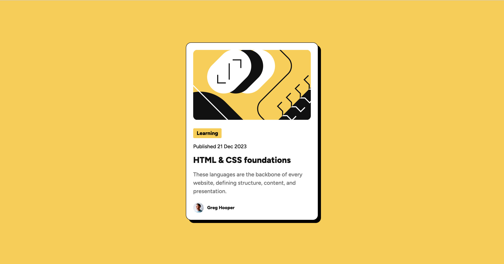

# Frontend Mentor - Blog preview card solution

This is a solution to the [Blog preview card challenge on Frontend Mentor]

## Table of contents

- [Overview](#overview)
  - [The challenge](#the-challenge)
  - [Screenshot](#screenshot)
  - [Links](#links)
- [My process](#my-process)
  - [Built with](#built-with)
- [Author](#author)

## Overview

### The challenge

Users should be able to:

- See hover and focus states for all interactive elements on the page

### Screenshot

### Links

- Solution URL: [Solution] (https://github.com/MarwaDawood/FrontendMentor_Blogpost)
- Live Site URL: [Live site] (https://frontendmentor-challengeblogpost.netlify.app/)

## My process

### Built with

- Semantic HTML5 markup
- CSS custom properties

## Author

- Website - [marwadawood.netlify.app)](https://marwadawood.netlify.app/)
- Frontend Mentor - [@MarwaDawood](https://www.frontendmentor.io/profile/MarwaDawood)

